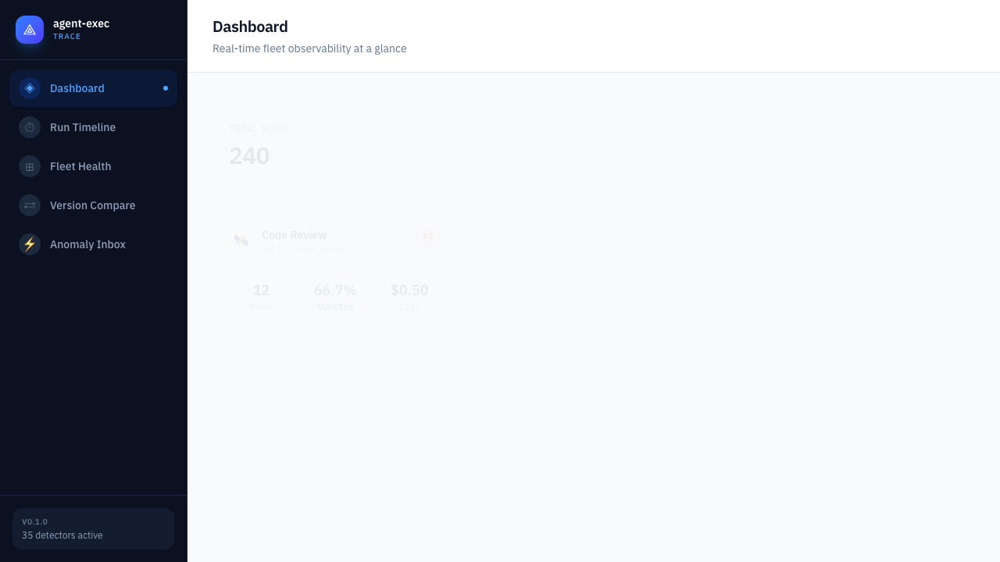
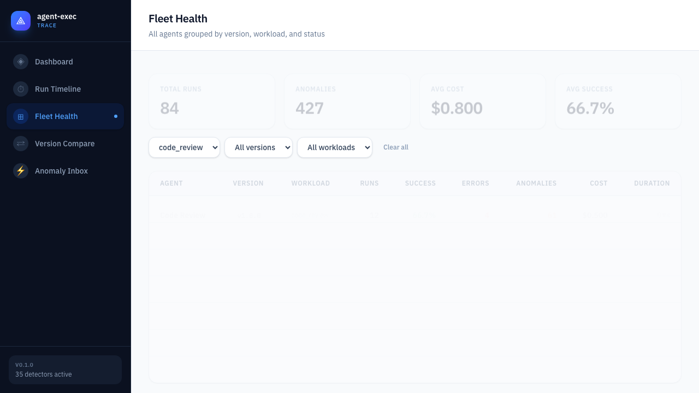
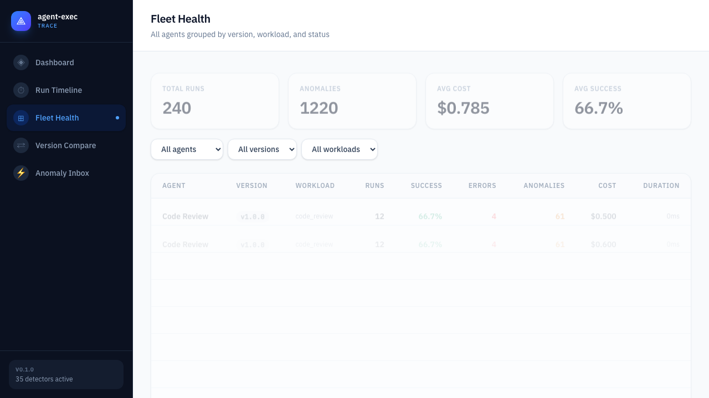
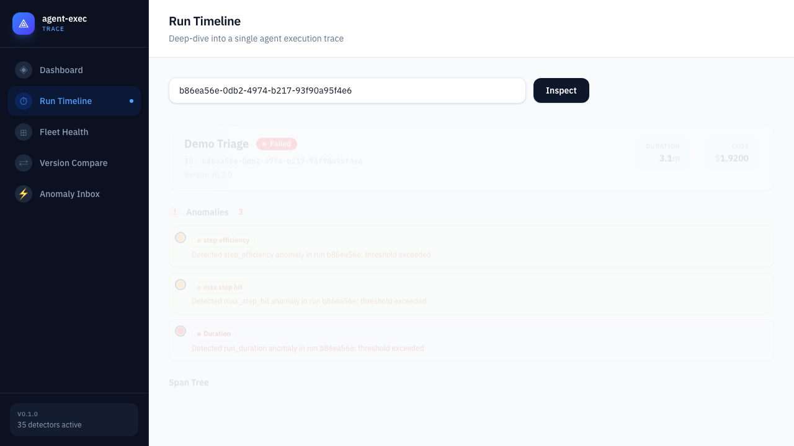
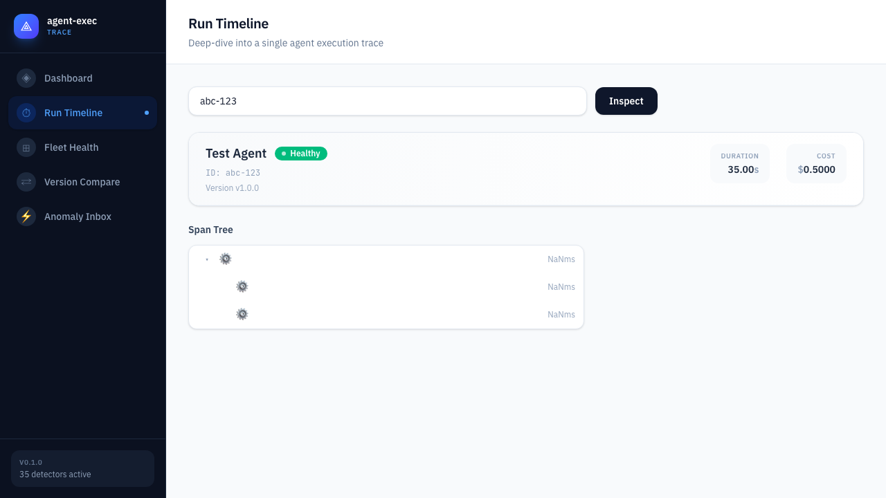
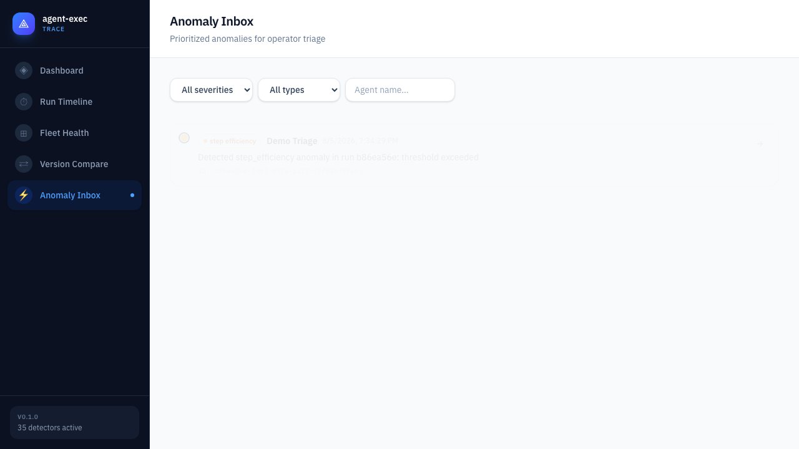
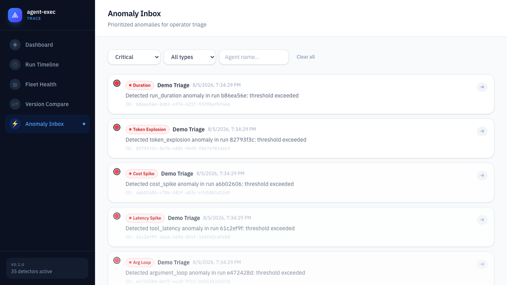
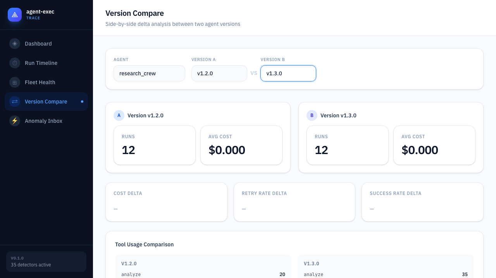

# agent-exec-trace User Guide

> v0.1.0 — Production-grade observability for AI agent workflows

---

## What is agent-exec-trace?

**agent-exec-trace** is an observability platform purpose-built for AI agent workflows. Agents are different from traditional services. A service handles requests predictably — you can monitor its latency, error rate, and throughput with standard tools. An agent makes decisions. It plans, calls tools, retrieves context, mutates memory, retries on failure, and accumulates cost with every LLM call. When an agent misbehaves, the failure mode is not a 500 error — it is a tool-call loop, a retry spiral, a cost spike, an output drift. Traditional observability was never designed to catch these failure modes.

agent-exec-trace solves this by treating every agent run as an execution trace — a structured, timestamped record of planning, tool calls, memory mutations, retries, approvals, and cost accumulation. These traces are captured through OpenTelemetry-compatible instrumentation and analyzed by 35 deterministic (rule-based) anomaly detectors across seven behavioral categories: Tool Execution, Cost & Resource, Runtime & Completion, Retry & Recovery, Interaction & Control, Output Quality, and Cross-Run Patterns. A further 5 LLM-augmented detectors provide semantic analysis for patterns that rule-based logic cannot detect — semantic loops, hallucinations, goal drift, quality degradation, and confusion patterns.

The system is not a replacement for your existing observability stack. It layers on top of Jaeger, Tempo, or any OTLP-compatible backend. It does not require you to ship prompts or tool arguments — metadata-only mode is the default. And it is local-first: the entire stack runs on a laptop before it needs a cluster.

The product is designed for the **operator** — the engineer or platform team member who needs to answer four questions:

1. **"Which agents are healthy right now?"** → Dashboard
2. **"Which agent-version combinations need attention?"** → Fleet Health
3. **"What exactly happened during this problematic run?"** → Run Timeline
4. **"Is the new version actually an improvement?"** → Version Compare
5. **"What should I investigate first?"** → Anomaly Inbox

---

## Getting Started

### Prerequisites

agent-exec-trace runs as a local Docker Compose stack. You will need:

| Prerequisite | Minimum Version | Check Command |
|---|---|---|
| Python | 3.10+ | `python3 --version` |
| Node.js | 20+ | `node --version` |
| Docker + Docker Compose | Recent stable | `docker compose version` |
| uv (recommended) or pip | Any | `uv --version` |

macOS users: Docker Desktop works out of the box. Linux users: ensure your user is in the `docker` group.

### First-Time Setup

Clone the repository and install the Python SDK + service packages:

```bash
git clone https://github.com/your-org/agent-exec-trace.git
cd agent-exec-trace

# Install SDK and services in editable mode
make setup

# Verify the quality gates (optional but recommended)
make format
make lint
make typecheck
make test
```

### Booting the Stack

The stack includes six services managed by Docker Compose:

```bash
make stack-up
```

This starts:

| Service | Description | Internal Port | Host Port |
|---|---|---|---|
| **api** | FastAPI read endpoints | 8000 | 8000 |
| **analytics** | Async anomaly detection worker | — | — |
| **web** | React operator UI (Vite dev server) | 5173 | 5173 |
| **postgres** | Read-model database | 5432 | 5433 |
| **jaeger** | Raw trace storage + query | 16686 | 16686 |
| **collector** | OTel Collector (OTLP ingest) | 4317/4318 | 4317/4318 |

Wait for all containers to report healthy before proceeding. You can verify with:

```bash
docker compose ps
```

All services should show `Up` or `healthy`.

### Seeding Demo Data

Before opening the UI, populate the database with deterministic demo data:

```bash
make seed-e2e
```

This seeds:

- **4 agents**: `research_crew`, `support_triage`, `code_review`, `demo_triage`
- **9 version cohorts**: e.g., `research_crew` v1.2.0 and v1.3.0, `support_triage` v1.0.0/v1.1.0/v2.0.0
- **96 runs**: ~8 success + 4 error per cohort
- **~240 anomalies**: covering every detector type with a mix of critical, warning, and info severities
- **Fleet rollups**: 7 daily windows per agent-version cohort
- **Version cohort summaries**: aggregates for the Compare view

The seed is deterministic — every run produces the same data. The intentional distributions include:

- Loop runs at specific indices (tool call loops with `loop_count=8`)
- Retry storm runs at specific indices (high `total_retries`)
- Cost spike runs at specific indices (elevated `estimated_cost`)
- Error runs at indices 8–11 in each 12-run batch

If you need to reset and re-seed:

```bash
make seed-e2e   # drops and recreates; idempotent
```

### Opening the UI

Navigate to **http://localhost:5173** in your browser.

The dashboard loads immediately with seeded data. The five product views are accessible from the left sidebar or top navigation bar:

- **Dashboard** — landing page with aggregate summaries
- **Fleet Health** — filterable table of all agents
- **Run Timeline** — deep-dive per-run debugger
- **Version Compare** — side-by-side delta comparison
- **Anomaly Inbox** — prioritized anomaly triage list

### Verifying the Full Stack

You can confirm every layer is working:

```bash
# Check the API health endpoint
curl http://localhost:8000/health

# Check seeded fleet data
curl http://localhost:8000/api/v1/fleet | python3 -m json.tool | head -30

# Open Jaeger UI (raw traces)
open http://localhost:16686
```

---

## Stack Architecture (Conceptual)

Before diving into views, it is helpful to understand the data flow:

```
Your Agent (LangGraph / Python)
    │
    ▼
Instrumentation SDK ─── emits behavior spans (OTLP)
    │
    ▼
OpenTelemetry Collector
    │
    ▼
Jaeger (raw trace storage)
    │
    ▼
Analytics Service ─── reads traces, computes anomalies
    │                     writes to Postgres read-model
    ▼
Postgres ◄── API Service ◄── React UI
```

The key concept: **traces are the source of truth, Postgres is the read model.** Anomalies, run summaries, fleet rollups, and version cohorts are all derived from traces and can be rebuilt at any time. This means:

- You can reset Postgres and recompute everything from Jaeger.
- Detector logic changes take effect on the next analytics pass.
- The API does not query Jaeger directly — it serves from the materialized read model for speed and product semantics.

---

## Dashboard

The Dashboard is the landing page and your fleet-level health overview. It renders immediately on load and serves as the starting point for deeper investigation.



### Summary Cards

Four aggregate cards sit at the top, giving you an immediate answer to "How is my fleet doing?"

| Card | Value Source | Interpretation |
|---|---|---|
| **Total Runs** | Count of all `run_summaries` rows in the current window | Broad activity level. Trending up = more agent usage. Trending down = possible deployment issue. |
| **Total Anomalies** | Sum of all `anomalies` records in the current window | Overall noise level. A healthy fleet should have few anomalies. A spike means something changed. |
| **Avg Cost** | Mean of `estimated_cost_usd` across all runs with cost data | Budget signal. Drifting upward without a corresponding increase in success rate warrants investigation. |
| **Avg Success Rate** | Percentage of runs with `status = 'success'` | The single most important fleet-health metric. Below 90% is concerning. Below 70% is critical. |

Each card shows a single number. Values of zero mean either no data exists or all values in that dimension are null. Cross-reference with Fleet Health if a card looks suspicious.

If an individual run's cost data is `NULL` (e.g., the instrumentation did not capture cost metadata), that run is excluded from the Avg Cost calculation but still included in the run count. This means the average might represent a subset of runs.

### Agent Cards

Below the summary cards, a responsive grid shows one card per agent. Each card displays:

```
┌──────────────────────────┐
│  research_crew           │
│  2 versions  ·  24 runs  │
│  ████████████░░  92%     │
└──────────────────────────┘
```

- **Agent name** — the identity string set via `gen_ai.agent.name` during instrumentation
- **Version count** — how many distinct `agent_version` values exist for this agent
- **Run count** — total invocations
- **Success rate bar** — visual percentage with colour coding:
  - Green (≥90%): healthy
  - Yellow (70–89%): needs attention
  - Red (<70%): investigate immediately

The grid auto-sizes for your screen width. With 4+ agents, cards wrap to multiple rows.

### Navigation: Card to Fleet

Clicking any agent card navigates to **Fleet Health** with that agent pre-selected in the filter dropdown. The fleet table immediately narrows to show only rows for that agent's versions and workloads.



This is the fastest path from "that agent's success rate looks low" to "let me inspect its version cohorts." The click preserves context — the agent filter is pre-populated, the table is filtered, and you can immediately click a version row to drill into a specific run.

---

## Fleet Health

Fleet Health is the operational command center. It shows every agent × version × workload cohort as a sortable, filterable table. It answers: *"Which cohorts need my attention?"*



### Column Reference

Each row represents one unique combination of `(agent_name, agent_version, workload_type)`. For agents running without version or workload metadata, those columns display as blank — the row still aggregates correctly.

| Column | Data Type | Meaning |
|---|---|---|
| **Agent** | String | Agent identity from instrumentation |
| **Version** | String or blank | Agent version label (`v1.2.0`). Blank if uninstrumented. |
| **Workload** | String or blank | Workload classification (`code-review`, `triage`). Blank if not set. |
| **Runs** | Integer | Total invocations in the current window |
| **Success Rate** | Percentage (0–100%) | Fraction of runs with `success` status |
| **Errors** | Integer | Run count with `error` or `cancelled` status |
| **Anomalies** | Integer | Total anomaly records associated with this cohort's runs |
| **Cost** | USD ($X.XX) | Mean `estimated_cost_usd` per run. Only runs with cost data included. |
| **Duration** | Milliseconds | Mean wall-clock duration (`ended_at - started_at`) per run |

Rows are sorted by **anomaly count descending** by default. This places the most problematic cohorts at the top — you should not need to scroll to find what is broken.

### Filtering the Table

Three dropdown filters sit above the table, applied with AND logic:

#### Agent Filter

Select a specific agent name from the dropdown. The table narrows to show only that agent's version cohorts.

**Example:** Selecting `support_triage` shows its three versions (v1.0.0, v1.1.0, v2.0.0) side by side, making it easy to spot which version is anomalous.

#### Version Filter

Further narrows to a specific version within the selected agent. This filter is only meaningful after selecting an agent — selecting a version without an agent applies no filter.

**Example:** Selecting `research_crew` then `v1.3.0` shows only the v1.3.0 cohort row.

#### Workload Filter

Limits to a specific workload type. Useful if your agent runs multiple workload types and you want to compare behaviour across workloads.

**Example:** If `support_triage` runs both `triage` and `escalation` workloads, filtering to `escalation` isolates the higher-complexity subset.

#### Combined Filtering

All three filters combine with AND logic:

```
Agent = research_crew AND Version = v1.3.0 AND Workload = code-review
```

This produces the most specific subset. If no rows match, an empty state message appears: "Try broadening your filter."

### Row Click: Navigate to Run Timeline

Clicking any row navigates to the Run Timeline for a representative run from that cohort. The run ID is selected automatically — you never need to copy-paste a UUID. The timeline loads with:

- The run's header (agent name, version, status, duration, cost)
- The run's anomaly list
- The run's span tree (if spans are available)

This is the primary investigation flow: **Fleet Health → Row Click → Run Timeline.**

### State Handling

| State | What You See | What to Do |
|---|---|---|
| **Normal** | Populated table with rows | Filter and click to investigate |
| **Loading** | Skeleton placeholder rows | Wait for API response (~200ms typical) |
| **No runs yet** | Prompt: "Instrument an agent and start generating traces" | Deploy your instrumented agent and check Jaeger for incoming traces |
| **Filter returns nothing** | Empty state with suggestion: "Try broadening your filter" | Remove one or more filters to expand the result set |
| **Error** | Error message with Retry button | Check that API and Postgres are healthy, then retry |

---

## Run Timeline

The Run Timeline is the deep-dive debugging view for a single agent run. It renders the run's header metadata, its anomaly records, and its full span tree — ordered, nested, expandable, and annotated with duration bars and anomaly markers. It answers: *"What exactly happened during this execution, step by step?"*



### Accessing a Run Timeline

There are three ways to reach the timeline:

1. **From Fleet Health**: Click any cohort row. The system auto-selects a representative run from that cohort.
2. **From Anomaly Inbox**: Click any anomaly row. The system navigates to that anomaly's linked run.
3. **Direct URL**: Navigate to `/runs/:runId` with a known run ID.

### Run Header

The header sits at the top of the timeline and provides immediate context:

| Field | Example Value | Notes |
|---|---|---|
| **Agent name** | `research_crew` | Which agent produced this run |
| **Status badge** | `error` (red) | Colour-coded: green = success, red = error, gray = cancelled |
| **Version** | `v1.3.0` | Agent version label; blank if not set |
| **Duration** | `42,380ms` | Total wall-clock time (ended_at − started_at) |
| **Cost** | `$1.82` | Estimated USD cost; best-effort, may be NULL |
| **Run ID** | `run_a1b2c3...` | Unique identifier, useful for cross-referencing with Jaeger or logs |

The Run ID is clickable — it copies to clipboard for use in external tools.

### Anomaly List

Below the header, the anomaly list shows every anomaly record linked to this run. If the run has no anomalies, this section is hidden.

Each anomaly item shows:

```
🔴 cost_spike
   Absolute spike: $5.80 exceeds $5.00; relative spike: $5.80 is 3.2x baseline $1.81
```

- **Severity dot**: Red = critical, yellow = warning, blue = info
- **Type badge**: Compact label with the anomaly type (`loop`, `cost_spike`, `retry_storm`, etc.)
- **Explanation**: The human-readable summary generated by the detector at detection time

The severity dot is the triage signal. Scan for red dots first, then yellow. Blue (info) items are informational and rarely need immediate action.

Clicking an anomaly badge scrolls to and highlights the relevant span in the span tree below. If the anomaly is not linked to a specific span (e.g., a fleet-level anomaly like `run_frequency_anomaly`), the click highlights the run header instead.

### Span Tree

The span tree is the core interactive component of the timeline. It renders every behavioural unit captured during the run as a nested, expandable tree with duration visualization.



#### Tree Structure

Spans are organized hierarchically:

```
▼ invoke_agent (42,380ms) ────────────────────────────
  ▼ plan (8,200ms) ──────────
    ├── execute_tool: search (1,200ms) ──
    ├── execute_tool: fetch (2,100ms) ────
    └── execute_tool: analyze (800ms) ─
  ▼ plan (12,400ms) ──────────────
    ├── retrieve: get_docs (3,500ms) ───────
    ├── create_memory (400ms) ─
    └── execute_tool: write (900ms) ──
```

- **Root span**: Always `invoke_agent` — the entire run
- **Child spans**: Planning phases, tool execution, retrieval, memory operations
- **Nesting**: Tool calls appear inside planning phases. Memory operations appear inside tool calls. The depth is arbitrary.
- **Ordering**: Spans are ordered by `start_time` ascending — chronological within each nesting level

#### Duration Bars

Each span row includes a horizontal duration bar. The bar width is proportional to the span's wall-clock time relative to the **total run duration** (not relative to its parent). This means:

- A 42-second span inside a 42-second run fills the full width.
- A 1-second span inside a 42-second run is a thin sliver.
- Duration bars are always right-aligned and show the absolute time in ms.

The duration bar makes long-running spans visually obvious. If a single tool call takes 30 seconds in a 40-second run, the bar will dominate the row — you do not need to read numbers to spot it.

#### Expand and Collapse

- Rows with a chevron (`▶`) have child spans. Click the chevron or the row to expand.
- A collapsed row shows a **count badge** indicating how many children are hidden: `(3 hidden)`.
- The tree supports any nesting depth. Expanding a root node reveals its children, which may themselves have children.
- Expand-all and collapse-all controls are available at the top of the tree for quick navigation.

#### Anomaly Markers

Spans linked to anomaly records have a coloured marker on the left edge of the row:

- Red marker: linked to a critical-severity anomaly
- Yellow marker: linked to a warning-severity anomaly
- Blue marker: linked to an info-severity anomaly

These markers let you scan the tree visually for problematic spans without reading every row.

### Span Detail Panel

Clicking any span row opens the detail panel on the right side of the screen (or below, on narrow viewports). The panel shows:

| Section | Content |
|---|---|
| **Span ID** | Unique span identifier (`span_7f3a...`) |
| **Operation** | The semantic operation name (`execute_tool`, `plan`, `retrieval`, etc.) |
| **Duration** | Exact wall-clock time in milliseconds |
| **Status** | Span status code (`ok`, `error`, `timeout`, or blank) |
| **Attributes** | All OTel key-value attributes attached to this span |

The attributes section is the raw evidence behind every anomaly. Key attributes to inspect:

| Attribute | Relevance |
|---|---|
| `gen_ai.tool.name` | Which tool was executed — links span to `tool_error_rate` or `specific_tool_error` anomalies |
| `gen_ai.tool.arguments` | What arguments were passed — inspect for `argument_loop` anomalies (identical args) |
| `gen_ai.tool.result` | What the tool returned — inspect for `wasted_tool_calls` or `redundant_tool_call` anomalies |
| `gen_ai.usage.prompt_tokens` | Input token count — relevant for `token_explosion` anomalies |
| `gen_ai.usage.completion_tokens` | Output token count — relevant for `token_explosion` anomalies |
| `gen_ai.agent.run.cost.total` | Cost attribution — if available at the span level |

Attributes are raw strings, JSON blobs, or numbers as emitted by the instrumentation SDK. The detail panel displays them as-is.

### Linked Anomalies (in Detail Panel)

If the selected span is linked to one or more anomaly records, those appear at the bottom of the detail panel with the same severity dots and type badges. Clicking an anomaly link scrolls the anomaly list at the top of the page.

### State Handling

| State | What You See | What to Do |
|---|---|---|
| **No run ID entered** | Prompt: "Enter a run ID or select from Fleet / Anomaly Inbox" | Navigate from Fleet or Inbox, or paste a known ID |
| **Run loaded with data** | Full timeline: header, anomaly list, span tree, detail panel | Inspect spans, expand the tree, review anomalies |
| **Run loaded, no spans** | Header + anomaly list + note: "No behaviour spans captured" | Check instrumentation config — metadata-only mode was on and no operation spans were emitted |
| **Run not found** | Error: "No run with this ID exists" with link to Fleet | Verify the Run ID; if correct, the run may not have been processed by analytics yet |
| **Loading** | Skeleton placeholders for header, anomalies, and span tree | Wait for API response |
| **Error** | Error message with Retry button | Check API and Postgres health |

---

## Anomaly Inbox

The Anomaly Inbox is the triage center. It shows every anomaly record in a filterable, prioritized list. It answers: *"What should I investigate first?"*



### Reading the Inbox

Each row represents one anomaly record. The columns are:

| Column | Content | Purpose |
|---|---|---|
| **Severity** | Coloured dot: 🔴 critical, 🟡 warning, 🔵 info | Immediate triage signal — scan for red first |
| **Type** | Anomaly type badge (`loop`, `cost_spike`, ...) | Categorizes the failure mode |
| **Agent** | Agent identity string | Tells you which agent to investigate |
| **Timestamp** | Detection time (`2026-08-05 14:22:10`) | When the anomaly was generated by analytics |
| **Explanation** | Human-readable summary | Context for understanding the anomaly without opening the run |
| **Run ID** | Clickable identifier | Link to the Run Timeline for deep-dive investigation |

Rows are sorted by severity (critical first), then by timestamp descending (newest first). This ensures the most urgent, most recent items appear at the top.

The explanation field is generated at detection time by each detector's `_build_anomaly` method. Examples:

- `Tool 'search_web' called 8 times consecutively`
- `Systemic retry failure: 0/5 retries succeeded (7 total retries)`
- `Run cost $12.40 is 4.1x version cohort baseline of $3.02`
- `Output drift: 1240 chars is 0.3x baseline 4133 chars (shorter)`

### Filtering

Three controls narrow the visible set:

#### Severity Filter

Dropdown with three options: `critical`, `warning`, `info`.

**Example:** Filtering to `critical` shows only the most urgent anomalies — systemic retry failures, cascading retry chains, anomaly clusters, and severe cost spikes.



#### Type Filter

Dropdown with all 40 anomaly types (see Reference section for the complete list). This is useful when you want to investigate a specific category of failure.

**Example:** Filtering to `loop` shows only tool-call loops and pattern loops. This lets you quantify how widespread looping behaviour is across your fleet.

#### Agent Filter

Free-text text input that filters by agent name. Typing `research` shows only anomalies from `research_crew`. This is the fastest way to see "what is wrong with agent X."

#### Combined Filtering

All three filters combine with AND logic:

```
Severity = critical AND Type = cost_spike AND Agent = research_crew
```

This produces the most specific triage view. If no rows match, an empty state message appears: "Try broadening your type, severity, or agent filter."

### Click-Through to Run Timeline

Clicking any row navigates directly to the Run Timeline for the anomaly's linked run. The timeline loads with:

- The run header populated
- The anomaly list pre-populated (showing all anomalies for that run, not just the one you clicked)
- The relevant span highlighted (if the anomaly is span-linked)

This is the primary triage workflow:

1. **Open the Anomaly Inbox**
2. **Filter to critical** to surface urgent items
3. **Scan explanations** for the most impactful anomaly
4. **Click the row** to jump to the Run Timeline
5. **Inspect the span tree** to understand root cause
6. **Take action** — code fix, configuration change, rollback, or detector threshold tuning

### State Handling

| State | What You See | What to Do |
|---|---|---|
| **Normal** | Populated list with anomaly rows | Filter, sort, click to investigate |
| **Loading** | Skeleton placeholder rows | Wait for API response |
| **No anomalies** | Positive message: "No anomalies detected in the current window" | Your fleet is healthy — check back later or expand the time window |
| **Filter returns nothing** | Message: "Try broadening your type, severity, or agent filter" | Remove or broaden one or more filters |
| **Error** | Error message with Retry button | Check API and Postgres health, then retry |

---

## Version Compare

Version Compare validates agent rollouts by computing side-by-side deltas between two version cohorts. It answers: *"Is the new version actually better, and in what ways?"*



### Selecting Versions

Three sequential inputs define the comparison:

1. **Agent** — dropdown of all known agent names. Select one.
2. **Version A** — dropdown of all observed versions for the selected agent. This is your **baseline** (e.g., the previous stable version).
3. **Version B** — dropdown of all observed versions for the selected agent. This is your **comparison** (e.g., the newly rolled-out version).

The UI enforces the selection order: version dropdowns populate only after an agent is selected. Until both versions are chosen, a placeholder message reads: "Select two versions to compare."

### Interpreting Delta Cards

Once both versions are selected, the API computes cohort-level deltas from the `version_cohort_summaries` table and renders them as comparison cards:

| Delta Card | Formula | Interpretation |
|---|---|---|
| **Cost Delta** | `avg_cost(Version B) − avg_cost(Version A)` | Negative (green) = cheaper per run. Positive (red) = more expensive. |
| **Retry Rate Delta** | `avg_retries(Version B) − avg_retries(Version A)` | Negative (green) = fewer retries. Positive (red) = more retries. |
| **Success Rate Delta** | `success_rate(Version B) − success_rate(Version A)` | Positive (green) = higher success rate. Negative (red) = more failures. |

Each delta card shows the absolute values for both versions, the delta value, and a colour-coded arrow:

```
Cost Delta
v1.2.0: $1.82    v1.3.0: $1.47
▼ -$0.35  (19% cheaper)
```

Colour coding:
- **Green** (improvement): cost down, retries down, success rate up
- **Red** (regression): cost up, retries up, success rate down
- **Gray** (no change): delta is zero or near-zero

### Tool Usage Comparison

Below the delta cards, a tool usage comparison table shows per-tool call-rate deltas between versions. Each row shows:

| Tool | Version A (rate/run) | Version B (rate/run) | Delta | Direction |
|---|---|---|---|---|
| `fetch_data` | 2.50 | 2.08 | −0.42 | Decrease |
| `analyze` | 1.67 | 2.92 | +1.25 | Increase |
| `search` | 0.83 | 0.42 | −0.41 | Decrease |

This table surfaces **behavioural shifts** between versions. For example:

- A 75% increase in `analyze` calls suggests the new version is doing more post-processing work.
- A 50% decrease in `search` calls might mean the new version caches results or uses a different retrieval strategy.
- A tool appearing in one version but not the other indicates a fundamentally different workflow.

The deltas are computed as `(tool_count_B / run_count_B) − (tool_count_A / run_count_A)` — the per-run call rate difference, not the raw count difference. This normalizes for different cohort sizes.

### Sparse Cohort Warning

When either version cohort has fewer than 5 runs, the UI displays a warning:

> **Sparse cohorts detected.** One or both version cohorts are small; deltas may not be statistically meaningful.

The comparison still renders, but operators should treat the deltas as low-confidence. The warning threshold (5 runs) is a conservative minimum — statistical significance typically requires 30+ runs per cohort, but 5 is the floor below which a single anomalous run can swing the delta dramatically.

**Example:** Version A has 28 runs (reasonable baseline). Version B has 3 runs (just deployed). The sparse warning fires because Version B's cohort is too small. The cost delta might show a 50% increase, but with only 3 runs, that could be caused by a single expensive run. Wait for more data before concluding.

### Edge Cases

#### Same Version on Both Sides

Comparing `v1.2.0` vs `v1.2.0` yields all-zero deltas. This is a valid comparison and is useful for verifying the API behaviour.

#### Version Not Found

If one of the selected versions has no runs in the database, the API returns a `version_not_found` error with a message like: "No runs exist for this version identifier."

#### One Version Selected

If only one version is selected (the other dropdown is empty), the placeholder message "Select two versions to compare" persists. No API call is made.

#### Loading

Skeleton placeholder cards render while the API computes deltas (typically <200ms).

#### Error

A retry prompt appears on API failure. Check that API and Postgres are healthy, then retry.

### State Handling

| State | What You See | What to Do |
|---|---|---|
| **No versions selected** | "Select two versions to compare" placeholder | Pick an agent, then two versions |
| **One version selected** | Prompt to select the second version | Pick the second version from the dropdown |
| **Both selected, loading** | Skeleton placeholder delta cards | Wait for API response |
| **Both selected, data** | Delta cards + tool usage table | Review deltas, assess rollout quality |
| **Sparse cohort** | Warning banner above deltas | Treat deltas as low-confidence; wait for more runs |
| **Version not found** | Error message with version identifier | Verify the version exists in the database |
| **Error** | Error message with Retry button | Check API and Postgres health |

---

## Common Investigation Workflows

The following step-by-step scenarios walk through the most common operator journeys. Each scenario uses the seeded demo data and assumes the stack is running at http://localhost:5173.

### Scenario 1: Triage a Critical Anomaly

**Context:** You receive a notification that the Anomaly Inbox has new critical-severity items. You need to identify the most impactful one and investigate root cause.

**Steps:**

1. **Open the Anomaly Inbox** from the top navigation bar. The list loads with all anomalies, sorted critical-first.

2. **Apply the severity filter** — select `critical` from the severity dropdown. The list narrows to only critical anomalies. In the seeded data, these include `systemic_retry`, `anomaly_cluster`, and high-severity `cost_spike` records.

3. **Scan the explanations column** to prioritize. A `systemic_retry` anomaly (explanation: "Systemic retry failure: 0/5 retries succeeded") is more urgent than a `cost_spike` on a known expensive workload. Read the explanation to understand the nature of the failure before clicking.

4. **Optionally apply a type filter** if you want to focus on a specific failure pattern. For example, filtering to `systemic_retry` shows only runs where all retries failed — these are the most likely to indicate a broken agent.

5. **Click the most concerning row.** The UI navigates to the Run Timeline for that anomaly's run.

6. **Inspect the anomaly list** at the top of the timeline to see all anomalies on this run. A single run can have multiple anomaly types — the `anomaly_cluster` detector fires when a run has ≥3 distinct types.

7. **Scan the span tree for anomaly markers** (red/yellow/blue indicators on the left edge of rows). These mark spans linked to anomalies. Expand the nested levels around marked spans to see the surrounding context.

8. **Click a marked span** to open the detail panel. Review the attributes:

   - For a `systemic_retry` anomaly: look at `gen_ai.retry.count` and tool status values. If every tool call shows `status: error`, the underlying API or tool is likely unavailable.
   - For a `cost_spike` anomaly: check `gen_ai.agent.run.cost.total` and compare to the typical cost for this agent version.
   - For a `tool_error_rate` anomaly: count the number of tool spans with non-ok statuses and identify which tool is failing.

9. **Determine the root cause** from the span evidence:
   - **Auth/permission failure**: All tool calls fail with similar error statuses → check API keys or permissions.
   - **Model confusion**: The agent calls different tools in a cycle (`pattern_loop`) without making progress → review the system prompt or tool descriptions.
   - **Resource exhaustion**: Token counts grow dramatically (`token_explosion`) and the run hits a step limit → increase step budget or reduce context window.
   - **External dependency**: A specific tool has a high latency (`tool_latency`) or times out (`tool_timeout`) → investigate the external service.

10. **Take action** — roll back the agent version, adjust detector thresholds, fix the tool integration, or tune the model configuration.

### Scenario 2: Investigate a Looping Agent from Fleet Health

**Context:** You notice in Fleet Health that the `demo_triage` v0.2.0 cohort has a high anomaly count and a success rate of only 67%. You suspect the agent is stuck in a tool-call loop.

**Steps:**

1. **Open Fleet Health** from the top navigation. The table loads with all cohorts, sorted by anomaly count descending.

2. **Locate the problematic cohort** — `demo_triage` v0.2.0 should appear near the top due to its high anomaly count. Note the low success rate and elevated cost compared to v0.1.0.

3. **Apply the Agent filter** — select `demo_triage` from the agent dropdown. The table narrows to show only `demo_triage` rows. If multiple versions exist (v0.1.0 and v0.2.0), compare their metrics side by side.

4. **Apply the Version filter** — select `v0.2.0` to isolate the problematic version. The table now shows a single row with the full metrics for this cohort.

5. **Click the row** to navigate to a representative run from this cohort. The Run Timeline loads automatically.

6. **Scan the anomaly list** at the top of the timeline. Look for `loop`, `pattern_loop`, or `argument_loop` anomalies. These confirm the looping hypothesis.

7. **Expand the span tree** — the root `invoke_agent` span likely contains deeply nested tool calls. Expand level by level, watching for repeated tool names.

8. **Identify the loop pattern**:
   - **Same tool consecutively**: Look for `execute_tool: search` appearing 5+ times in a row without any other operations between them. This triggers the `loop` detector.
   - **Pattern cycle**: Look for a repeating sequence like `search → fetch → analyze → search → fetch → analyze`. This triggers the `pattern_loop` detector.
   - **Same arguments**: Click each repeated tool span and check the `gen_ai.tool.arguments` attribute in the detail panel. If the arguments are identical, the `argument_loop` detector has fired.

9. **Assess whether the loop is real or a false positive**:
   - **Legitimate iteration**: If the tool is `check_status` and the agent is polling for a deployment, this might be intentional. Add `check_status` to the polling tool allowlist in the analytics configuration.
   - **Genuine loop**: If the tool is `search_web` with different queries but none of the results are changing the execution path, the model is stuck. This requires a prompt or logic fix.

10. **For genuine loops**, investigate:
    - Is the model receiving the tool results correctly? Check tool result attributes in the detail panel.
    - Is there a condition in the agent logic that never evaluates to true?
    - Does the model have a step budget that is too high, allowing loops to continue unchecked?

11. **Compare with the previous version** — navigate to Version Compare, select `demo_triage` v0.1.0 vs v0.2.0. If the retry rate and cost went up while success rate went down, the new version introduced the looping behaviour.

12. **Roll back or fix** — revert to v0.1.0 if the regression is severe, or patch the agent logic to detect and break out of the loop pattern.

### Scenario 3: Compare Two Versions After a Rollout

**Context:** You just deployed `research_crew` v1.3.0 to replace v1.2.0. After 30 minutes, you want to verify the new version is performing better.

**Steps:**

1. **Open Version Compare** from the top navigation. The three selectors appear: Agent, Version A, Version B.

2. **Select `research_crew`** from the agent dropdown. The version dropdowns populate with v1.2.0, v1.3.0, and potentially v1.4.0 (from seeded data).

3. **Set Version A to `v1.2.0`** (the baseline — the version you are replacing).

4. **Set Version B to `v1.3.0`** (the comparison — the newly deployed version).

5. **Review the delta cards**:
   - **Cost Delta**: Is v1.3.0 cheaper or more expensive per run? In the seeded data, expect a non-zero delta. A cost DECREASE is good (green). A cost INCREASE should be justified by other improvements.
   - **Retry Rate Delta**: Does v1.3.0 retry less? Fewer retries means the agent is succeeding on the first attempt more often — a strong signal of improved reliability.
   - **Success Rate Delta**: Is v1.3.0 completing more runs successfully? This is the most important metric. Even if cost increased slightly, a significant success rate improvement may justify it.

6. **Review the Tool Usage table**:
   - Tools with large positive deltas are called MORE frequently in v1.3.0. Ask: is this intentional? Did we add a new retrieval step? Are we doing more analysis?
   - Tools with large negative deltas are called LESS frequently. Ask: did we remove a step? Is the agent skipping a tool it should still be using?
   - Tools appearing in only one version indicate a fundamental workflow change. Verify this is by design.

7. **Check for the sparse cohort warning**. If v1.3.0 only has a handful of runs (after 30 minutes, this is likely), the warning appears. Acknowledge it — the deltas are directionally useful but not statistically reliable yet. Check back in a few hours or the next day when more runs have accumulated.

8. **If deltas look good**: cost down or flat, success rate up, retries down, tool usage as expected → **the rollout is validated.** Keep monitoring for the next 24 hours.

9. **If deltas regress**: cost up, success rate down, retries up, unexpected tool usage shifts → **investigate before the rollout reaches more traffic.**

10. **To investigate a regression**:
    - Open Fleet Health and filter to `research_crew` v1.3.0.
    - Click a cohort row to inspect a specific run.
    - Check the anomaly list — are there new anomaly types that did not appear in v1.2.0?
    - Expand the span tree to see what step in the workflow is different.
    - Compare tool arguments between versions to identify parameter changes.

11. **Decide**: roll forward (keep the new version and fix issues), roll back (revert to v1.2.0), or canary (keep v1.3.0 on a subset of traffic while investigating).

### Scenario 4: Fleet-Wide Health Check (Daily Review)

**Context:** It is your daily operational review. You want to quickly assess fleet health and identify any new issues since yesterday.

**Steps:**

1. **Open the Dashboard.** Scan the four summary cards:
   - Has **Total Runs** changed significantly from yesterday? A sudden drop might indicate a deployment issue.
   - Has **Total Anomalies** spiked? A jump from ~50 to ~200 warrants immediate investigation.
   - Is **Avg Cost** trending up? A gradual increase over days suggests a slow cost leak.
   - Is **Avg Success Rate** below your SLA threshold? If it dropped from 95% to 88%, something changed.

2. **Scan the agent cards** for any red (<70%) success rate bars. These are your immediate candidates for investigation.

3. **Click the worst-performing agent card** to navigate to Fleet Health, pre-filtered to that agent.

4. **If the agent has multiple versions**, compare success rates between versions. If only one version is failing while others are healthy, the issue is version-specific.

5. **Click the problematic version row** to drill into a specific run timeline.

6. **Scan the anomaly list** for the most frequent anomaly type — this is likely the systemic issue.

7. **If no single agent stands out**, open the Anomaly Inbox and filter to `critical` severity. Scan for recurring patterns (e.g., the same tool is failing across multiple agents — this suggests an external dependency issue).

8. **Document your findings** and create action items: detector threshold adjustments, agent code fixes, external dependency investigations, or version rollbacks.

---

## Reference: Anomaly Types

agent-exec-trace ships 35 deterministic (rule-based) anomaly detectors across 7 behavioural categories and 5 LLM-augmented detectors. Every rule-based detector produces structured anomaly records with severity, explanation, and evidence payloads. All detectors have configurable thresholds per workload.

The detection engine is deterministic-first by design — no LLM is required to decide whether an anomaly occurred. The 5 LLM-augmented detectors provide additional semantic analysis and degrade gracefully (returning no anomaly) when the LLM is unavailable.

### Tool Execution (8 detectors)

These detectors analyze tool call patterns within a single run's span tree: sequencing, error rates, latency, and argument-level redundancy.

| Anomaly Type | Primary Key | Default Threshold | What It Detects | False Positive Risk |
|---|---|---|---|---|
| `loop` | `loop_threshold` | 5 consecutive calls | Same tool called consecutively beyond threshold — agent stuck in a tool-call loop | Legitimate iteration (e.g., pagination). Mitigated by polling tool allowlist. |
| `pattern_loop` | `pattern_loop_window` | Window size 4 | Repeating sequences of different tools (A→B→C→A→B→C). More sophisticated than `loop`. | Intended cyclic workflows. Requires pattern to repeat ≥2 times. |
| `argument_loop` | `argument_loop_threshold` | 3 consecutive calls | Same tool + same arguments called consecutively. Strongest loop signal. | Single retry (2 calls). 3+ is almost certainly a bug. |
| `tool_error_rate` | `tool_error_rate_pct` | 30% error rate | Overall tool error rate across all tool spans exceeds threshold | Very few tool calls (1/2 = 50%). Requires ≥1 tool call. |
| `specific_tool_error` | `specific_tool_error_pct` | 30% error rate | A single tool type has error rate ≥ threshold, even if overall rate is normal | Too few calls for that tool (<2). Requires ≥2 calls per tool type. |
| `tool_latency` | `tool_latency_multiplier` | 3× average | Individual tool call duration significantly exceeds average for that tool in the same run | Cold-start effects on first call. Mitigated by comparing within the same run. |
| `tool_timeout` | `tool_timeout_seconds` | 60 seconds | Any tool call exceeding absolute duration limit | Legitimately slow operations (large file downloads). Tune per workload. |
| `redundant_tool_call` | `redundant_tool_threshold` | 3 consecutive matches | Same tool + same args + same result repeated — definitive wasted work | Idempotent operations (e.g., `get_current_time`). Rare in agent traces. |

**Evidence produced by each detector:**

- `loop`: `tool_name`, `consecutive_calls`, `threshold`, `polled_tools_skipped` (if any)
- `pattern_loop`: `pattern` (list of tool names), `repeat_count`, `window_size`
- `argument_loop`: `tool_name`, `consecutive_calls`, `threshold`
- `tool_error_rate`: `error_rate_pct`, `errors`, `total_tool_spans`, `threshold_pct`
- `specific_tool_error`: `tool_name`, `error_rate_pct`, `errors`, `total_calls`, `threshold_pct`
- `tool_latency`: `tool_name`, `call_index`, `duration_ms`, `average_duration_ms`, `ratio`, `multiplier`
- `tool_timeout`: `tool_name`, `duration_ms`, `limit_ms`, `span_id`
- `redundant_tool_call`: `redundant_count`, `threshold`, `output_preview`

### Cost & Resource (6 detectors)

These detectors analyze cost metrics, token usage, and tool efficiency. Some require database access for baseline comparison.

| Anomaly Type | Primary Key | Default Threshold | What It Detects | Notes |
|---|---|---|---|---|
| `cost_spike` | `cost_threshold_usd` + `cost_baseline_multiplier` | $5 absolute AND/OR 2× baseline | Run cost exceeds absolute and/or relative threshold. Dual-mode detection. | Requires `estimated_cost_usd` to be non-null. Async detector — needs DB pool. |
| `cost_vs_baseline` | `cost_vs_baseline_multiplier` | 2× baseline | Pure relative comparison — does NOT check absolute threshold | Only fires when baseline exists. Complements `cost_spike`. |
| `cost_efficiency` | `cost_per_tool_high` + `cost_efficiency_max_calls` | $0.50/tool or 20+ tool calls | High cost-per-tool or too many tool calls for a successful run | Only checks successful runs (failed runs are expected to have many calls). |
| `token_explosion` | `token_explosion_multiplier` | 3× growth | Late-half token count ≥ 3× early-half token count | Requires ≥4 spans with token data for meaningful split. |
| `per_tool_cost_spike` | `per_tool_cost_multiplier` | 2× dominance ratio | Single tool type accounts for >50% of total cost | Tool must have ≥3 calls and dominance ratio ≥ multiplier. |
| `wasted_tool_calls` | `wasted_tool_threshold` | 3 occurrences | Different tools returning the same result — calls had no effect | Result must appear across ≥2 different tool types. |

**Evidence produced by each detector:**

- `cost_spike`: `cost`, `absolute_threshold`, `baseline_cost` (if available), `baseline_multiplier`
- `cost_vs_baseline`: `cost`, `baseline`, `ratio`, `multiplier`
- `cost_efficiency`: `cost`, `tool_calls`, `cost_per_tool`, `threshold` (or `max_efficient`, `tool_calls`)
- `token_explosion`: `early_avg_tokens`, `late_avg_tokens`, `ratio`, `multiplier`
- `per_tool_cost_spike`: `tool_name`, `tool_calls`, `total_tool_calls`, `tool_share_pct`, `est_tool_cost`, `total_cost`, `dominance_ratio`, `multiplier`
- `wasted_tool_calls`: `wasted_count`, `threshold`, `output_preview`

### Runtime & Completion (5 detectors)

These detectors analyze run duration, step budgets, execution gaps, and completion patterns.

| Anomaly Type | Primary Key | Default Threshold | What It Detects | Notes |
|---|---|---|---|---|
| `run_duration` | `run_duration_multiplier` | 5× baseline | Total run duration significantly exceeds version cohort baseline | Requires async DB query for baseline. |
| `max_step_hit` | (none — fixed logic) | ≥20 tool calls + incomplete status | Agent exhausted its step budget or was terminated before completing | Also fires if >50 tool calls with plan spans, even if status is not explicitly incomplete. |
| `step_efficiency` | `step_efficiency_max_calls` | 50 tool calls | Too many steps for a successful run — the task should have required fewer | Only checks successful runs. |
| `inactivity` | `inactivity_gap_seconds` | 60 seconds | Long idle gap between consecutive spans — agent was waiting or hung | Requires ≥2 spans with start times. |
| `premature_completion` | (none — fixed logic) | — | Run marked as error but no error spans, OR ended with plan/think span | Two detection paths: error status without error evidence, or incomplete status with terminal plan span. |

**Evidence produced by each detector:**

- `run_duration`: `duration_ms`, `baseline_ms`, `ratio`, `multiplier`
- `max_step_hit`: `tool_calls`, `status`
- `step_efficiency`: `tool_calls`, `threshold`, `status`
- `inactivity`: `max_gap_ms`, `threshold_ms`, `from_span_id`, `to_span_id`
- `premature_completion`: `status`, `total_spans`, `error_spans` (or `final_span_operation`, `has_output`, `successful_terminal_tool`)

### Retry & Recovery (5 detectors)

These detectors analyze retry behaviour: count, success rate, cascading effects, and recovery complexity.

| Anomaly Type | Primary Key | Default Threshold | What It Detects | Severity |
|---|---|---|---|---|
| `retry_storm` | `retry_threshold` | 5 retries | Excessive total retry count — basic count threshold | Scales with count |
| `systemic_retry` | (none — fixed logic) | — | All retries failed (0% success rate across ≥2 retries) | Always `critical` |
| `transient_retry` | `transient_retry_threshold` | ≥threshold retries with ≥50% success | Many retries where most succeeded — downgraded to info | Always `info` |
| `cascading_retry` | (none — fixed logic) | — | Retry chain spans ≥2 different tools — failure propagates | `warning` |
| `recovery_path` | `recovery_path_threshold` | 5 extra steps after first error | Unusually complex recovery — agent struggled to recover | Scales with count |

**Evidence produced by each detector:**

- `retry_storm`: `total_retries`, `threshold`
- `systemic_retry`: `total_retries`, `retry_events`, `success_rate` (always 0.0)
- `transient_retry`: `total_retries`, `retry_events`, `success_rate`
- `cascading_retry`: `total_retries`, `affected_tools`, `retry_chain`, `unique_tool_count`
- `recovery_path`: `steps_after_error`, `threshold`, `total_tool_spans`, `first_error_index`

### Interaction & Control (4 detectors)

These detectors analyze human-agent interaction patterns: intervention frequency, escalation rates, approval latency, and overrides.

| Anomaly Type | Primary Key | Default Threshold | What It Detects | Notes |
|---|---|---|---|---|
| `intervention_frequency` | `intervention_frequency_threshold` | 3 interventions | Excessive human interventions per run | Counts from `total_interventions` on run summary. |
| `escalation_rate` | `escalation_rate_multiplier` | 2× baseline | Intervention count exceeds version cohort baseline | Async detector; requires DB pool and baseline with intervention data. |
| `approval_latency` | `approval_latency_seconds` | 60 seconds | Human approval took longer than threshold | Walks spans for `human_intervention`, `await_approval`, `ask_user`. |
| `intervention_rejection` | `intervention_rejection_threshold` | 2 rejection patterns | Human repeatedly overrode agent decisions (intervention → retry → intervention) | Scans for triples in the flattened span list. |

**Evidence produced by each detector:**

- `intervention_frequency`: `interventions`, `threshold`
- `escalation_rate`: `interventions`, `baseline_avg`, `ratio`, `multiplier`
- `approval_latency`: `approval_duration_ms`, `threshold_ms`, `span_id`, `total_intervention_spans`
- `intervention_rejection`: `rejection_count`, `total_interventions`, `threshold`

### Output Quality (4 detectors)

These detectors analyze the agent's final output: emptiness, length, status clarity, and drift from baseline.

| Anomaly Type | Primary Key | Default Threshold | What It Detects | Notes |
|---|---|---|---|---|
| `empty_response` | (none — fixed logic) | — | Agent produced no measurable output | Uses `_extract_output()` across all spans. |
| `low_output` | `low_output_min_chars` | 50 characters | Output shorter than minimum expected length | Only fires when output exists but is too short (not empty). |
| `indeterminate_status` | (none — fixed set) | — | Run status is None, empty, or ambiguous | Known ambiguous values: unknown, undefined, null, none, unclear, indeterminate, pending, na, n/a. |
| `output_drift` | `output_drift_multiplier` | 3× or 1/3× baseline | Output length deviates significantly from version cohort baseline | Async detector; checks both directions (too long and too short). Also computes Shannon entropy. |

**Evidence produced by each detector:**

- `empty_response`: `output_length` (0), `total_spans`
- `low_output`: `output_length`, `min_expected`
- `indeterminate_status`: `status` (original value or None)
- `output_drift`: `output_length`, `baseline_length`, `ratio`, `entropy`, `multiplier`

### Cross-Run Patterns (3 detectors)

These detectors analyze patterns that span multiple runs, requiring database access.

| Anomaly Type | Primary Key | Default Threshold | What It Detects | Severity |
|---|---|---|---|---|
| `anomaly_cluster` | `anomaly_cluster_min_types` | 3 distinct types | Multiple anomaly types on the same run — run is fundamentally compromised | Always `critical` |
| `run_frequency_anomaly` | `run_frequency_min_runs` + `run_frequency_max_multiplier` | <5 runs or >15 runs | Version cohort has too few or too many runs | `warning` for both directions |
| `first_run_heuristic` | (none — fixed logic) | — | First run of a new agent version — flagged for review | Always `info` |

**Evidence produced by each detector:**

- `anomaly_cluster`: `distinct_anomaly_types`, `anomaly_types` (sorted list), `threshold`
- `run_frequency_anomaly`: `run_count`, `min_expected` or `threshold`, `agent_version`
- `first_run_heuristic`: `agent_version`, `agent_name`

### LLM-Augmented Detectors (5 detectors)

These detectors use a local LLM (MLX / OpenAI-compatible endpoint) for semantic analysis. Each degrades gracefully — when the LLM is unavailable, they return `None` and the rule-based pipeline continues unaffected. These detectors require a running LLM endpoint to produce anomalies.

| Anomaly Type | What It Detects | How It Works |
|---|---|---|
| `semantic_loop` | Semantically identical outputs repeated across consecutive agent turns | Compares pairs of agent outputs using LLM similarity judgment (>0.95 threshold) |
| `hallucination` | Claims in agent output unsupported by trace context and tool results | Sends claim + trace context to LLM for verification; fires if hallucination detected |
| `goal_drift` | Agent's actions diverging from the original stated goal or plan | Extracts goal from plan spans, compares to final actions via LLM |
| `quality_degradation` | Output quality drop compared to baseline | Compares current output to baseline output via LLM quality assessment |
| `confusion_pattern` | Contradictions between plan and execution | Extracts plan text and execution summary, asks LLM to detect contradictions |

These detectors are not part of the deterministic truth path — they augment the rule-based pipeline and can be toggled independently. Evidence payloads include the LLM's reasoning and confidence scores where available.

---

### Severity Levels

All anomaly records carry one of three severity levels:

| Severity | Meaning | Examples | Action |
|---|---|---|---|
| **critical** | Run is fundamentally broken or at immediate risk | `systemic_retry` (all retries failed), `anomaly_cluster` (3+ anomaly types), `cost_spike` at 3× absolute threshold | Investigate immediately |
| **warning** | Unusual behaviour that warrants attention | `loop` (tool call loop), `cost_spike` above baseline, `output_drift`, `premature_completion` | Investigate during next triage cycle |
| **info** | Informational flag — not necessarily a problem | `transient_retry` (retries succeeded), `first_run_heuristic` (new version deployed) | Acknowledge; no immediate action required |

---

## Reference: Configuration

Detector thresholds are configured via the analytics service's settings. The configuration file lives at `services/analytics/src/analytics/config.py`. Key threshold variables:

| Variable | Default | Controls |
|---|---|---|
| `loop_threshold` | 5 | `loop` detector — consecutive same-tool calls |
| `pattern_loop_window` | 4 | `pattern_loop` detector — sliding window size |
| `argument_loop_threshold` | 3 | `argument_loop` detector — same-tool + same-args calls |
| `tool_error_rate_pct` | 30.0 | `tool_error_rate` detector — overall error rate % |
| `specific_tool_error_pct` | 30.0 | `specific_tool_error` detector — per-tool error rate % |
| `tool_latency_multiplier` | 3.0 | `tool_latency` detector — × average multiplier |
| `tool_timeout_seconds` | 60.0 | `tool_timeout` detector — absolute timeout |
| `redundant_tool_threshold` | 3 | `redundant_tool_call` detector — consecutive identical calls |
| `cost_threshold_usd` | 5.0 | `cost_spike` detector — absolute USD threshold |
| `cost_baseline_multiplier` | 2.0 | `cost_spike` detector — baseline multiplier |
| `cost_vs_baseline_multiplier` | 2.0 | `cost_vs_baseline` detector — baseline multiplier |
| `cost_per_tool_high` | 0.50 | `cost_efficiency` detector — cost-per-tool threshold |
| `cost_efficiency_max_calls` | 20 | `cost_efficiency` detector — max efficient tool calls |
| `token_explosion_multiplier` | 3.0 | `token_explosion` detector — late/early token ratio |
| `per_tool_cost_multiplier` | 2.0 | `per_tool_cost_spike` detector — dominance ratio |
| `wasted_tool_threshold` | 3 | `wasted_tool_calls` detector — repeated output threshold |
| `run_duration_multiplier` | 5.0 | `run_duration` detector — × baseline multiplier |
| `step_efficiency_max_calls` | 50 | `step_efficiency` detector — max tool calls for success |
| `inactivity_gap_seconds` | 60.0 | `inactivity` detector — max idle gap |
| `retry_threshold` | 5 | `retry_storm` detector — retry count threshold |
| `transient_retry_threshold` | — | `transient_retry` detector — threshold for info-severity storms |
| `recovery_path_threshold` | 5 | `recovery_path` detector — extra steps after error |
| `intervention_frequency_threshold` | 3 | `intervention_frequency` detector — intervention count |
| `escalation_rate_multiplier` | 2.0 | `escalation_rate` detector — × baseline multiplier |
| `approval_latency_seconds` | 60.0 | `approval_latency` detector — max approval wait |
| `intervention_rejection_threshold` | 2 | `intervention_rejection` detector — rejection pattern count |
| `low_output_min_chars` | 50 | `low_output` detector — minimum output length |
| `output_drift_multiplier` | 3.0 | `output_drift` detector — deviation multiplier |
| `anomaly_cluster_min_types` | 3 | `anomaly_cluster` detector — distinct types threshold |
| `run_frequency_min_runs` | 5 | `run_frequency_anomaly` detector — minimum runs |
| `run_frequency_max_multiplier` | 3.0 | `run_frequency_anomaly` detector — max = min × multiplier |

All thresholds can be overridden via environment variables. See `services/analytics/src/analytics/config.py` for the exact environment variable names.

---

## Troubleshooting

### The dashboard shows all zeros

**Likely cause:** The seed data has not been loaded, or the Postgres connection is broken.

**Check:**

```bash
# Verify the API can reach Postgres
curl http://localhost:8000/health

# Check if seed data exists
curl http://localhost:8000/api/v1/fleet | python3 -m json.tool | head -20

# Re-seed if empty
make seed-e2e
```

### The UI loads but a specific view returns an error

**Likely cause:** The API service crashed or the Postgres connection was interrupted.

**Check:**

```bash
# Restart the API service
docker compose restart api

# Check API logs for errors
docker compose logs api --tail 50
```

### Anomalies are not appearing in the Inbox

**Likely cause:** The analytics worker has not processed traces, or the detector thresholds are too high for your data.

**Check:**

```bash
# Verify the analytics worker is running
docker compose ps analytics

# Check analytics logs
docker compose logs analytics --tail 50

# Force reprocessing (if supported by your deployment)
# See docs/architecture/ for replay/rebuild instructions
```

### The span tree is empty for every run

**Expected in v0.1.0.** The seed script populates run summaries and anomalies but does not produce span tree data. Real span trees are generated when instrumented agents emit traces through OTLP and the analytics worker processes them. The Playwright test suite uses a stubbed span tree fixture to exercise the SpanTree UI component.

### Jaeger shows traces but the UI does not

**Likely cause:** The analytics worker has not processed the traces into the Postgres read model.

**Check:** The analytics worker runs on a polling interval (configurable). New traces should appear in the UI within the polling window. Check the analytics worker logs for processing activity:

```bash
docker compose logs analytics --tail 20
```

---

## Glossary

| Term | Definition |
|---|---|
| **Agent** | A named, versioned runtime workload that is instrumented and observed. |
| **Anomaly** | A computed behavioural signal — a pattern that deviates from expected agent behaviour. Generated by detectors. |
| **Cohort** | A group of runs sharing the same `agent_name` and `agent_version`. Used for baselines and comparisons. |
| **Detector** | A deterministic, rule-based function that analyzes run data and produces anomaly records. Each detector targets one failure pattern. |
| **OTel / OpenTelemetry** | The vendor-neutral observability framework used for trace emission and collection. |
| **OTLP** | OpenTelemetry Protocol — the wire format for trace export. |
| **OTel Collector** | The middleware service that receives OTLP traces and routes them to backends (Jaeger, Tempo, etc.). |
| **Read Model** | The materialized Postgres tables (run_summaries, anomalies, fleet_rollups, version_cohort_summaries) that the API serves. Derived from raw traces by the analytics worker. |
| **Run** | One end-to-end invocation of an agent — from start to completion, cancellation, or error. |
| **Span** | One unit of behaviour inside a run — planning, tool execution, retrieval, memory operation. Spans are nested hierarchically. |
| **Span Tree** | The ordered, nested hierarchy of all spans within a run. The primary data structure rendered in the Run Timeline. |
| **Trace** | The complete set of spans for a run, stored in Jaeger/Tempo. The source of truth from which the read model is derived. |
| **Version Cohort** | See Cohort. Specifically a cohort identified by `agent_version`. |
| **Workload** | A classification label for the type of task an agent is performing (e.g., `code-review`, `triage`). Set during instrumentation. |

---

*agent-exec-trace v0.1.0 — Built on OpenTelemetry. Behaviour-first. Deterministic-first. Local-first.*